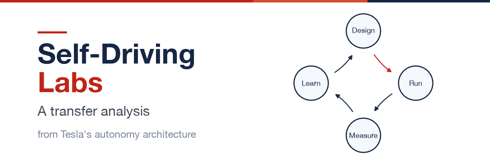

[中文](README.md) | **English**

# Tesla's Autonomy Architecture → Self-Driving Labs



An exploration of whether — and how — Tesla's autonomous-driving architecture (data engine, unified telemetry, shadow mode, intervention-rate north star, fleet learning, distillation push-down, canary release, safety layering) and open-source reference implementations transfer to research-oriented Self-Driving Labs (SDL), a core infrastructure pattern of AI for Science.

Scope: SDL across all domains — chemical synthesis, biology/strain engineering, proteins and antibodies, devices and materials, and process optimization.

Rationale: the first wave of AI for Science broke through at the software layer (AlphaFold and its kin); SDL is its **principal vehicle into the physical laboratory**.

**Repository**: [GitHub](https://github.com/platovest/tesla-architecture-to-self-driving-labs)

## Contents

| File | Description |
|---|---|
| [tesla-architecture-to-self-driving-labs.en.md](docs/tesla-architecture-to-self-driving-labs.en.md) | Full text |
| [tesla-architecture-to-self-driving-labs.html](docs/tesla-architecture-to-self-driving-labs.html) | Typeset version, print-to-PDF ready |

## Core Claims

1. **The systems-engineering layer transfers universally**: data engine, unified telemetry schema, shadow mode, intervention-rate north star, safety layering, two-stage learning, distillation push-down, canary release — eight mechanisms assessed one by one; the SDL field is already spontaneously reinventing most of them (the scalability / generalizability / provenance-complete requirements in Nature Reviews Chemistry's decade review are the data-engine philosophy translated into research terms).
2. **The learning-paradigm layer partially holds today**: the three preconditions of end-to-end imitation learning (fleet data, objective function, ground-truth validation) are time-indexed constraints with dynamic dissolution paths — not laws.
3. **Five anti-patterns**: caution on end-to-end; never cut the ground-truth channel (Goodhart); a three-way split for marketing claims; price "future unlock" promises at zero; vertical integration is not dogma (the Dojo lesson).
4. **Three open narrative niches**: the explicit element-by-element mapping (this document is the first draft); naming and pipelining an SDL "shadow mode"; intervention rate as a unified SDL operational metric.

## Versions

- **v1.0** (2026-08): first public release.

## License

[CC BY-SA 4.0](LICENSE) — attribution (platovest) and share-alike required.

## Citation

```
platovest. Tesla's Autonomy Architecture → Self-Driving Labs. v1.0. 2026-08. CC BY-SA 4.0.
```

Original Chinese title: *特斯拉架构思想 → 自驱动实验室 Self-Driving Labs*

Issues / PRs pointing out factual errors or adding new evidence are welcome; verify key figures against the primary sources before citing (evidence tags are marked in the text).
