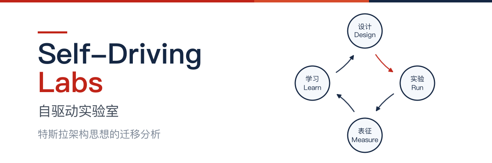

**中文** | [English](README.en.md)

# 特斯拉架构思想 → 自驱动实验室



探讨：把特斯拉自动驾驶的架构思想（数据引擎、统一遥测、影子模式、干预率北极星、车队学习、蒸馏下沉、金丝雀发布、安全分层）+ 开源可参考件，迁移到科研的自驱动实验室（Self-Driving Labs，SDL），是否成立、如何落地。

范围覆盖全领域 SDL：化学合成、生物/菌株工程、蛋白与抗体、器件与材料、流程优化。

定位依据：AI for Science 的代表性进展（AlphaFold 一类）集中在软件层，SDL 是它**走向物理实验世界的主要载体**。

**开源地址**：[GitHub](https://github.com/platovest/tesla-architecture-to-self-driving-labs)

## 内容

| 文件 | 说明 |
|---|---|
| [tesla-architecture-to-self-driving-labs.md](docs/tesla-architecture-to-self-driving-labs.md) | 正文 |
| [tesla-architecture-to-self-driving-labs.html](docs/tesla-architecture-to-self-driving-labs.html) | 排版版，可打印为 PDF |

## 核心论点

1. **系统工程层迁移普适成立**：数据引擎、统一遥测 schema、影子模式、干预率北极星、安全分层、两段式学习、蒸馏下沉、金丝雀发布——八个机制逐项判定，SDL 领域正在自发重新发明其中多数（Nature Reviews Chemistry 十年综述的 scalability / generalizability / provenance-complete 三要求即数据引擎哲学的科研翻译）。
2. **学习范式层今天部分成立**：端到端模仿学习的三个前提约束（fleet 数据、目标函数、真值验证）是时间索引的，各有动态消解路径，不是定律。
3. **五条反面教训**：端到端审慎、勿删真值通道（防古德哈特）、宣传口径三分法、"未来解锁"按零计价、垂直整合不是教条（Dojo）。
4. **三个可占的空缺叙事位**：逐要素系统化映射（本文即初稿）、SDL 版影子模式的命名与流水线化、干预率作为统一运营指标。

## 版本

- **v1.0**（2026-08）：首个公开版。

## 许可证

[CC BY-SA 4.0](LICENSE) — 转载改编请署名（platovest）并以相同方式共享。

## 引用

```
platovest. 特斯拉架构思想 → 自驱动实验室 Self-Driving Labs. v1.0. 2026-08. CC BY-SA 4.0.
```

英文题名：*Tesla's Autonomy Architecture → Self-Driving Labs*

欢迎 issue / PR 指出事实错误或补充新证据；关键数字引用前请核对原文（文内已标注证据口径）。
